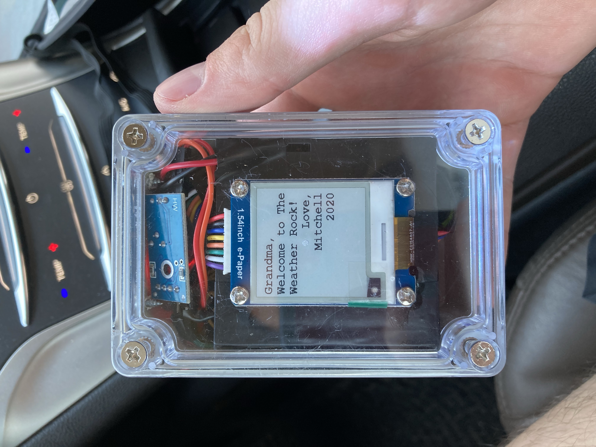
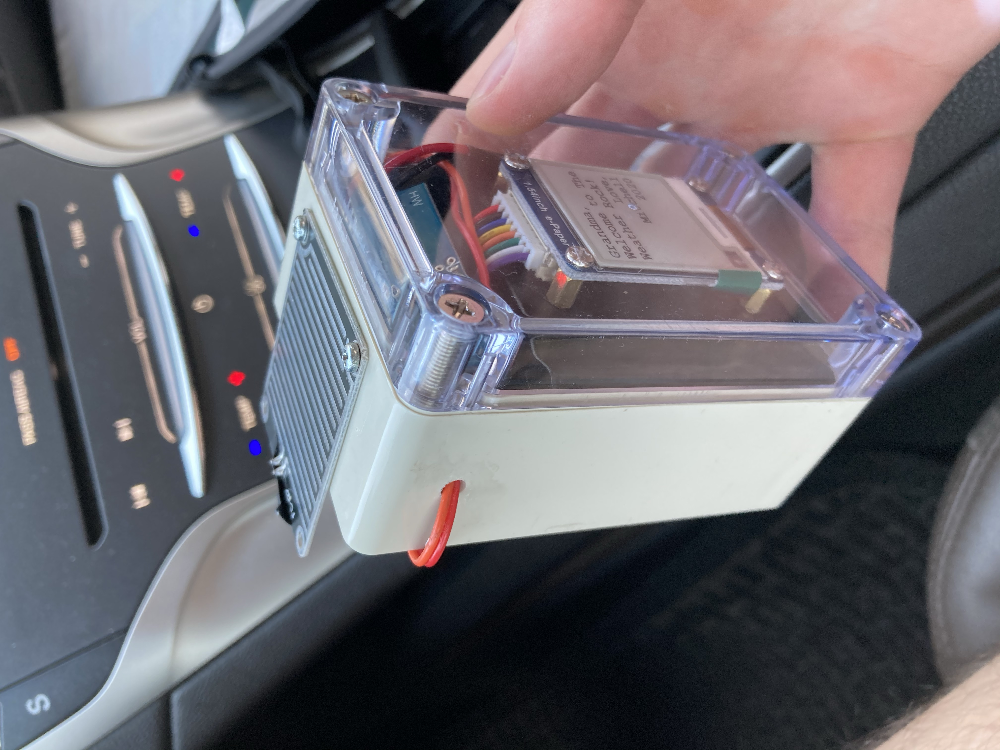

# The-Weather-Rock v1.0
As a gift to my grandmother, The Weather Rock is an Arduino based weather station.

# Here's a look at v1!

## Materials/Hardware
[Housing](https://www.amazon.com/gp/product/B07C97HXX8/ref=ppx_yo_dt_b_asin_title_o01_s00?ie=UTF8&psc=1)

Arduino Uno

Rain Intensity Measurement

Waveshare 1.54 Inch E-Paper Display

[bq27441 Battery Babysitter](https://learn.sparkfun.com/tutorials/battery-babysitter-hookup-guide/all#bq27441-arduino-library)

2500mAh Li-Ion Poly Battery

## Demos
[Rain Measurement](https://www.youtube.com/watch?v=nyFkCpdZvac)

[Rain Measurement 2](https://www.youtube.com/watch?v=YlIH1ti4Vy0)

[Display 1](https://www.youtube.com/watch?v=OPaCF-XJhqc)

[Display 2](//https://www.youtube.com/watch?v=UBEhod2wxvE)
